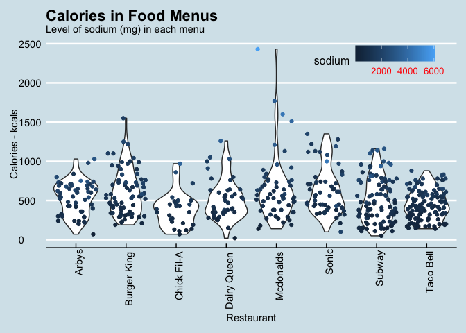
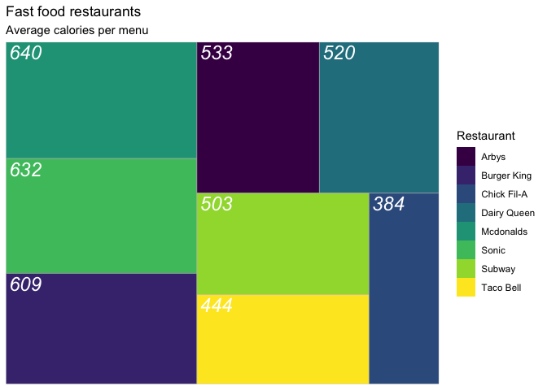

Restaurant
================
Selim Ach
10/5/2020

Very often data are presented in a tabular format and the challenge is
to be able to process information in order to provide relevant insights.

It is also sometimes useful to display all the data sample, for a first
visual inspection (e.g. identify potential outliers) and take a decision
on how to narrow down the sample to the variables of interest.

Hereafter is an example of how data can be presented to have a first
glance at the information and another chart with an additional layer of
information.

-----

    ## # A tibble: 15 x 18
    ##       X1 restaurant item  calories cal_fat total_fat sat_fat trans_fat
    ##    <dbl> <chr>      <chr>    <dbl>   <dbl>     <dbl>   <dbl>     <dbl>
    ##  1     1 Mcdonalds  Arti…      380      60         7       2       0  
    ##  2     2 Mcdonalds  Sing…      840     410        45      17       1.5
    ##  3     3 Mcdonalds  Doub…     1130     600        67      27       3  
    ##  4     4 Mcdonalds  Gril…      750     280        31      10       0.5
    ##  5     5 Mcdonalds  Cris…      920     410        45      12       0.5
    ##  6     6 Mcdonalds  Big …      540     250        28      10       1  
    ##  7     7 Mcdonalds  Chee…      300     100        12       5       0.5
    ##  8     8 Mcdonalds  Clas…      510     210        24       4       0  
    ##  9     9 Mcdonalds  Doub…      430     190        21      11       1  
    ## 10    10 Mcdonalds  Doub…      770     400        45      21       2.5
    ## 11    11 Mcdonalds  File…      380     170        18       4       0  
    ## 12    12 Mcdonalds  Garl…      620     300        34      13       1.5
    ## 13    13 Mcdonalds  Gril…      530     180        20       7       0  
    ## 14    14 Mcdonalds  Cris…      700     300        34       9       0  
    ## 15    15 Mcdonalds  Hamb…      250      70         8       3       0  
    ## # … with 10 more variables: cholesterol <dbl>, sodium <dbl>, total_carb <dbl>,
    ## #   fiber <dbl>, sugar <dbl>, protein <dbl>, vit_a <dbl>, vit_c <dbl>,
    ## #   calcium <dbl>, salad <chr>

<!-- -->

This chart is an overview of the fast food restaurants and associated
menus with an indication of their level of calories. The possibilities
to plot each menu (a dot by menu) is an interesting feature to grasp an
ideal of the number of menus offered by each restaurant.

<!-- -->

In addition to the level of calories per menu, this chart allows also to
display an extra dimension, here it is the level of sodium and the shape
of the distribution. In this way, it is possible to offer a complete
overview, within a single graph of the range of calories by menu (and by
restaurant) as well as its associated level of sodium.

-----

Another interesting possibility is to create a chart that will
facilitate the comparisons between restaurants in terms of average
calories served per menu. The chart below is an example of such
visualization using treemap.

<!-- -->
