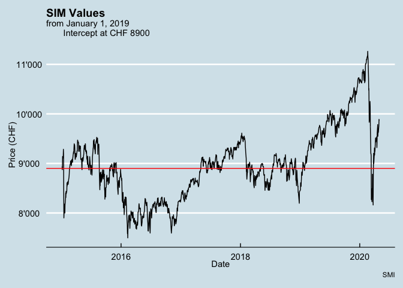
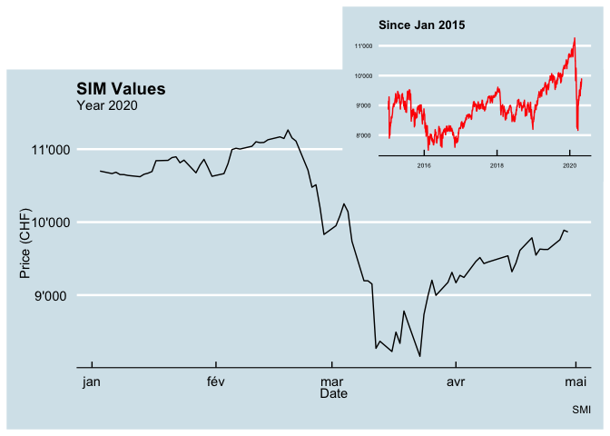
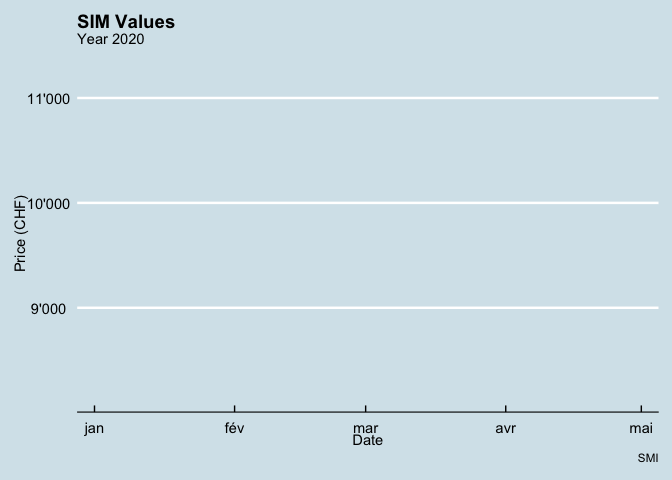

SMI
================
Selim Ach
10/17/2020

The objective of this report is to provide an example of a high
frequency charts with the possibility to change the scale at which
information are displayed (change frequency and time frame), but also
add specific information on the chart itself. These types of charts can
be fully customized depending on the business needs.

More to come soon with dynamic charts and
dashboards.

-----

#### A lineplot (from January 1, 2015 to April 29, 2020) indicating the fluctuation of the SMI index.

<!-- -->

#### A lineplot with a red line indicating a threshold is added to the plot.

<!-- -->

#### Another interesting feature is to add another chart to zoom or to show the general trend of the time series.

<!-- -->

-----

An interesting feature is to animate the chart

<!-- -->

-----

In the next chart, simple forecast models are implemented to predict the
values of the SMI, taking into account pre-covid period. Three models
are presented here. The first one is a naive prediction, which consist
of using the last value of the time series to predict the future. The
second model, drift, consist of drawing a line between the first and the
last observation to extrapolate future values. The last one is a
(simplistic) model showing the mean of the time series.

<!-- -->
