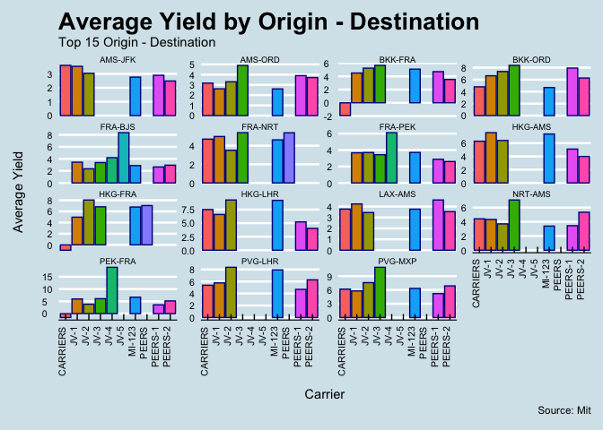
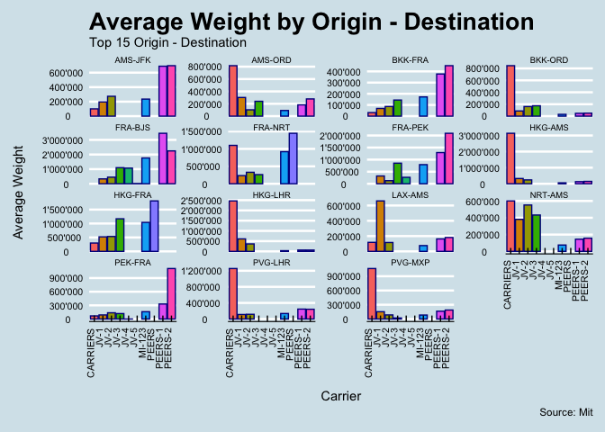
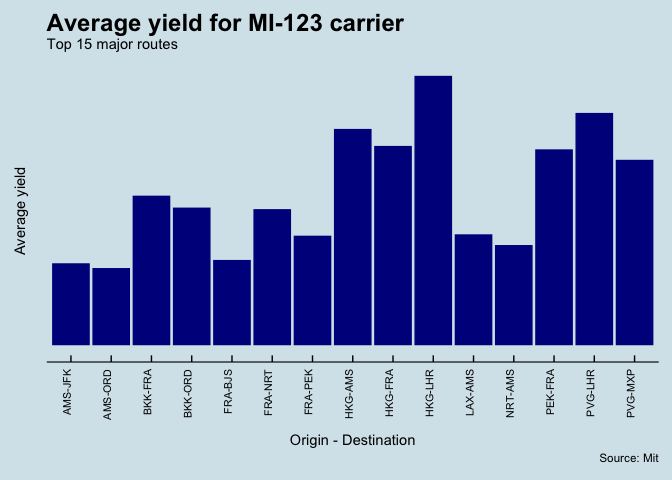
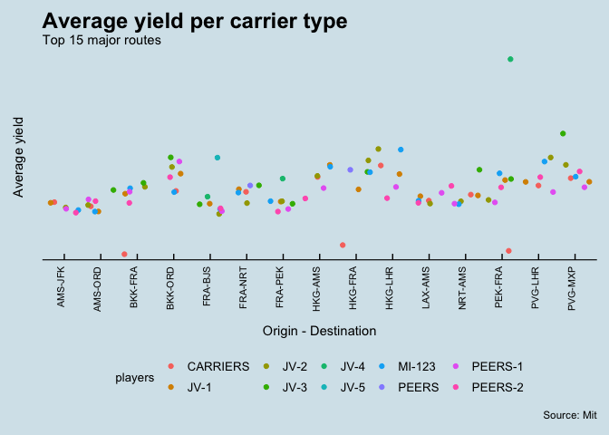
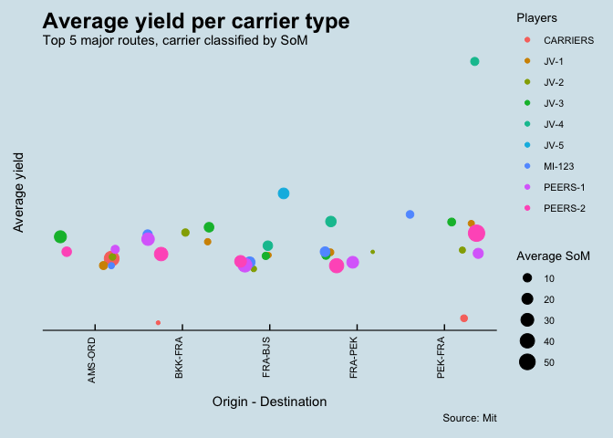

Airline performance
================
Selim Ach
10/13/2020

The objective of this report is to provide some illustrations on how to
benchmark airlines performance (cargo) using different set of
indicators. This is particular relevant to effectively visualizing
pricing and commercial positioning.

-----

## Average yield by carrier type (for the top 15 O-D)

The first figure is an example of a multiple bar chart that will show
how an airline of reference is performing against direct competitors.
Indeed, in a competitive environment, what is more relevant is sometimes
the behavior of the direct competitor of similar size compared to the
overall average. The chart below indicate the positioning of the carrier
of reference MI (123) versus Peers.

<!-- -->

## Average weight by carrier type (for the top 15 O-D)

This is a similar figure, using a different KPI (here the average weight
offered).

<!-- -->

## Average yield per carrier type and O-D

This is classical bar chart showing the price (average yield) offered on
main routes.

<!-- -->

## This charts shows the average yield per carrier type

Very often, it is helpful to visualize several parameters on a single
chart. The figure below shows the average yield on main routes as well
as the number of carriers (and their characteristics) operating on these
routes.

<!-- -->

## This chart shows the average yield per carrier type

Finally, the last figure combine average yield per carrier as well as an
indication of the share of market (SoM) on some selected routes.

<!-- -->
