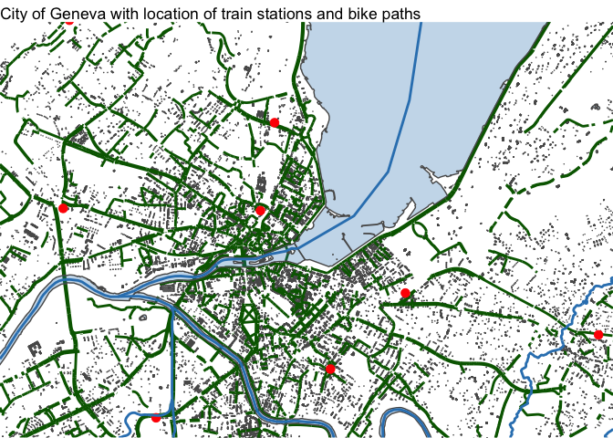
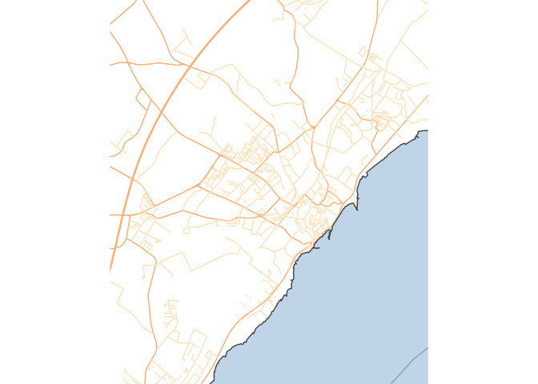

cartography
================
Selim Ach
11/20/2020

The objective is to plot on a map some features of the city of Geneva
including bike paths and also main train station. This visualization can
be complemented by other information if available, such as road traffic
during the
    day.

### City of Geneva

    ## Reading layer `CAD_BATIMENT_HORSOL_TOIT_SP' from data source `/Users/selim/Documents/datascience/visualization/Mobility and Transportation/Cartography_city/Data/SHP_CAD_BATIMENT_HORSOL_TOIT_SP/CAD_BATIMENT_HORSOL_TOIT_SP.shp' using driver `ESRI Shapefile'
    ## Simple feature collection with 124339 features and 6 fields
    ## geometry type:  MULTIPOLYGON
    ## dimension:      XY
    ## bbox:           xmin: 2486336 ymin: 1110441 xmax: 2512590 ymax: 1135439
    ## CRS:            2056

    ## Reading layer `AGGLO_GARES' from data source `/Users/selim/Documents/datascience/visualization/Mobility and Transportation/Cartography_city/Data/SHP_AGGLO_GARES/AGGLO_GARES.shp' using driver `ESRI Shapefile'
    ## Simple feature collection with 82 features and 12 fields
    ## geometry type:  POINT
    ## dimension:      XY
    ## bbox:           xmin: 2475352 ymin: 1084145 xmax: 2542757 ymax: 1154321
    ## CRS:            2056

    ## Reading layer `OTC_AMENAG_2ROUES' from data source `/Users/selim/Documents/datascience/visualization/Mobility and Transportation/Cartography_city/Data/SHP_OTC_AMENAG_2ROUES/OTC_AMENAG_2ROUES.shp' using driver `ESRI Shapefile'
    ## Simple feature collection with 5542 features and 10 fields
    ## geometry type:  MULTILINESTRING
    ## dimension:      XY
    ## bbox:           xmin: 2486071 ymin: 1110417 xmax: 2511898 ymax: 1135573
    ## CRS:            2056

<!-- -->

-----

### City of Nyon

The following example is the creation of a map of the city of Nyon,
focusing on main roads and pedestrian streets.

<!-- -->
