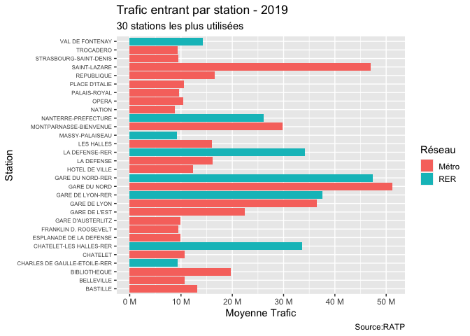
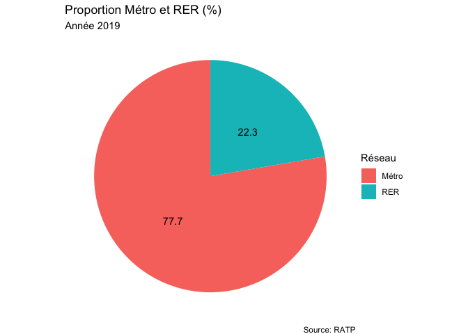

Mobilite\_RATP
================
Selim Ach
18/10/2020

Ce document est rédigé à des fins d’illustration et l’analyse se base
sur des données publiques provenant de la RATP. L’analyse statistique
est faite avec le logiciel de programmation R, et a pour but de donner
un aperçu des différentes possibilités de traitement de données, de
production d’indicateurs et autres graphiques.

-----

Source - <https://dataratp2.opendatasoft.com/explore/?sort=modified>

Ce jeu de données détaille le trafic des entrants directs sur le réseau
ferré RATP en 2019.

Les « entrants directs » sont exclusivement les voyageurs provenant de
la voie publique ou du réseau SNCF entrant sur le réseau de transport
RATP en validant un titre de transport valide.

Les voyageurs en correspondance (y compris correspondances métro/RER)
sur le réseau RATP ne sont pas comptabilisés.

### Statistiques descriptives générales

#### Fréquentation

<!-- -->

#### Moyenne, fréquentation maximale et minimale

<table class="table" style="margin-left: auto; margin-right: auto;">

<thead>

<tr>

<th style="text-align:left;">

Réseau

</th>

<th style="text-align:right;">

Moyenne

</th>

<th style="text-align:right;">

Max

</th>

<th style="text-align:right;">

Min

</th>

</tr>

</thead>

<tbody>

<tr>

<td style="text-align:left;">

Métro

</td>

<td style="text-align:right;">

4,593,587

</td>

<td style="text-align:right;">

51,141,374

</td>

<td style="text-align:right;">

169,939

</td>

</tr>

<tr>

<td style="text-align:left;">

RER

</td>

<td style="text-align:right;">

6,046,202

</td>

<td style="text-align:right;">

47,417,703

</td>

<td style="text-align:right;">

419,294

</td>

</tr>

</tbody>

</table>

### Statistiques descriptives par ligne de métro et RER

#### Pic voyageurs - RER

<table class="table" style="margin-left: auto; margin-right: auto;">

<thead>

<tr>

<th style="text-align:left;">

Réseau

</th>

<th style="text-align:left;">

Station

</th>

<th style="text-align:right;">

Trafic

</th>

</tr>

</thead>

<tbody>

<tr>

<td style="text-align:left;">

RER

</td>

<td style="text-align:left;">

GARE DU NORD-RER

</td>

<td style="text-align:right;">

47,417,703

</td>

</tr>

</tbody>

</table>

#### Pic voyageurs - Métro

<table class="table" style="margin-left: auto; margin-right: auto;">

<thead>

<tr>

<th style="text-align:left;">

Réseau

</th>

<th style="text-align:left;">

Station

</th>

<th style="text-align:right;">

Trafic

</th>

</tr>

</thead>

<tbody>

<tr>

<td style="text-align:left;">

Métro

</td>

<td style="text-align:left;">

GARE DU
NORD

</td>

<td style="text-align:right;">

51,141,374

</td>

</tr>

</tbody>

</table>

### Répartition des voyageurs RER et Métro

<!-- -->

<!--html_preserve-->

<!--/html_preserve-->
