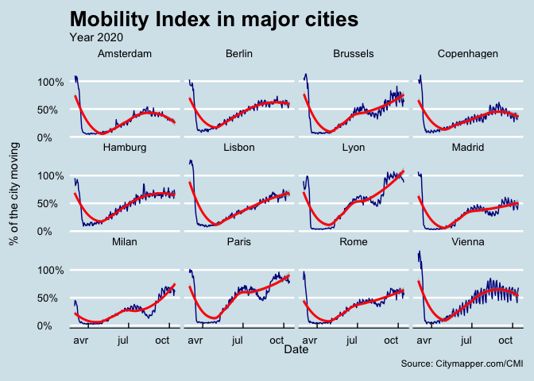

Mobility Index
================
Selim Ach
15/10/2020

This graph indicates the evolution of the mobility index in major
European cities based on data collected by “Citymapper”.

It is interesting to note that mobility in Paris seems to have resumed
to (almost) pre-covid, while in other cities (e.g. Copenhagen), it is
not yet the case.

<!-- -->

Note (definition of the index as per the website):

The Citymapper Mobility Index is calculated by comparing trips planned
in the Citymapper app to a recent typical usage period. Trips planned
(‘Get Me Somewhere’ and related) are correlated to trips taken (GO
mode). Typical usage period is defined as 4 weeks between Jan 6th and
Feb 2nd, 2020. To better capture typical usage in certain cities we are
using different periods in Paris (Feb 3rd to March 1st) and Hong Kong
and Singapore (both Dec 2nd to Dec 22nd). A day is defined as midnight
to midnight UTC, thus for certain cities may not correspond with
calendar days. Data are updated every day at 7am UTC.

Users include public transport, and also walking, cycling, some
micromobility and to be confident that it represents a real change in
behaviour. However, it is a sample set of general mobility and may not
represent the real world exactly.
