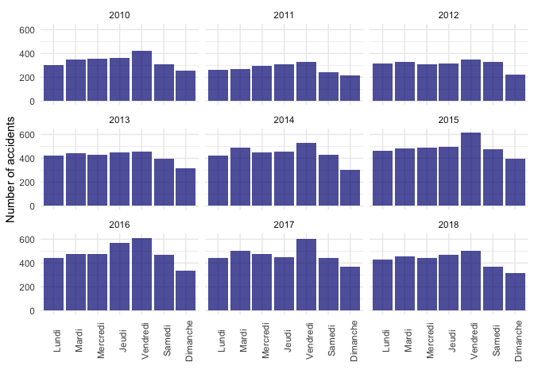

Road accidents
================
Selim Ach
10/15/2020

The data that is analyzed in this report is related to road accidents
occurring in Geneva. These type of data are usually presented in a
table, but there are better ways, such as using maps.

Let’s first look at the overall data with a first overview of the number
of accidents by day and year.

<!-- -->

<table>

<caption>

Extract of the information on road accidents in Geneva

</caption>

<thead>

<tr>

<th style="text-align:left;">

date

</th>

<th style="text-align:left;">

groupe\_accident

</th>

<th style="text-align:left;">

commune

</th>

<th style="text-align:left;">

conditions\_meteo

</th>

</tr>

</thead>

<tbody>

<tr>

<td style="text-align:left;">

2010-06-16

</td>

<td style="text-align:left;">

Dérapage ou perte de maîtrise

</td>

<td style="text-align:left;">

Bernex

</td>

<td style="text-align:left;">

Pluie

</td>

</tr>

<tr>

<td style="text-align:left;">

2010-02-25

</td>

<td style="text-align:left;">

Accident impliquant des piétons

</td>

<td style="text-align:left;">

Genève

</td>

<td style="text-align:left;">

Beau temps

</td>

</tr>

<tr>

<td style="text-align:left;">

2010-09-13

</td>

<td style="text-align:left;">

Accident en parquant

</td>

<td style="text-align:left;">

Genève

</td>

<td style="text-align:left;">

Beau temps

</td>

</tr>

<tr>

<td style="text-align:left;">

2010-12-06

</td>

<td style="text-align:left;">

Accident en s’engageant sur une route

</td>

<td style="text-align:left;">

Carouge

</td>

<td style="text-align:left;">

Beau temps

</td>

</tr>

<tr>

<td style="text-align:left;">

2010-11-04

</td>

<td style="text-align:left;">

Accident en quittant une route

</td>

<td style="text-align:left;">

Pregny-Chambésy

</td>

<td style="text-align:left;">

Temps couvert

</td>

</tr>

<tr>

<td style="text-align:left;">

2010-12-26

</td>

<td style="text-align:left;">

Dérapage ou perte de maîtrise

</td>

<td style="text-align:left;">

Genthod

</td>

<td style="text-align:left;">

Temps couvert

</td>

</tr>

<tr>

<td style="text-align:left;">

2010-04-09

</td>

<td style="text-align:left;">

Accident par tamponnement

</td>

<td style="text-align:left;">

Bernex

</td>

<td style="text-align:left;">

Beau temps

</td>

</tr>

<tr>

<td style="text-align:left;">

2010-08-06

</td>

<td style="text-align:left;">

Dérapage ou perte de maîtrise

</td>

<td style="text-align:left;">

Lancy

</td>

<td style="text-align:left;">

Beau temps

</td>

</tr>

<tr>

<td style="text-align:left;">

2010-11-30

</td>

<td style="text-align:left;">

Dérapage ou perte de maîtrise

</td>

<td style="text-align:left;">

Genève

</td>

<td style="text-align:left;">

Chute de neige

</td>

</tr>

<tr>

<td style="text-align:left;">

2010-02-01

</td>

<td style="text-align:left;">

Dérapage ou perte de maîtrise

</td>

<td style="text-align:left;">

Genève

</td>

<td style="text-align:left;">

Beau temps

</td>

</tr>

<tr>

<td style="text-align:left;">

2010-07-14

</td>

<td style="text-align:left;">

Accident par tamponnement

</td>

<td style="text-align:left;">

Versoix

</td>

<td style="text-align:left;">

Beau temps

</td>

</tr>

<tr>

<td style="text-align:left;">

2010-05-19

</td>

<td style="text-align:left;">

Dérapage ou perte de maîtrise

</td>

<td style="text-align:left;">

Genève

</td>

<td style="text-align:left;">

Beau temps

</td>

</tr>

<tr>

<td style="text-align:left;">

2010-03-04

</td>

<td style="text-align:left;">

Accident par tamponnement

</td>

<td style="text-align:left;">

Genève

</td>

<td style="text-align:left;">

Beau temps

</td>

</tr>

<tr>

<td style="text-align:left;">

2010-03-01

</td>

<td style="text-align:left;">

Dérapage ou perte de maîtrise

</td>

<td style="text-align:left;">

Genève

</td>

<td style="text-align:left;">

Beau temps

</td>

</tr>

<tr>

<td style="text-align:left;">

2010-06-20

</td>

<td style="text-align:left;">

Accident par tamponnement

</td>

<td style="text-align:left;">

Genève

</td>

<td style="text-align:left;">

Beau temps

</td>

</tr>

</tbody>

</table>

-----

Since the information on longitude and latitude is available, it is
possible to plot on a graph the exact location of each accident.

<!-- -->

<!-- -->

An extra layer with Geneva map is added on top of the location.

<!-- -->

These set of maps show the location of road accidents in Geneva during
the year 2018. But are there more accidents during a rainy day ?
Surprisingly the data indicates that accidents are occurring during
sunny days.

But let’s look at the number of accidents per year by developing a set
of maps that will display accidents by year since 2015.

<!-- -->
