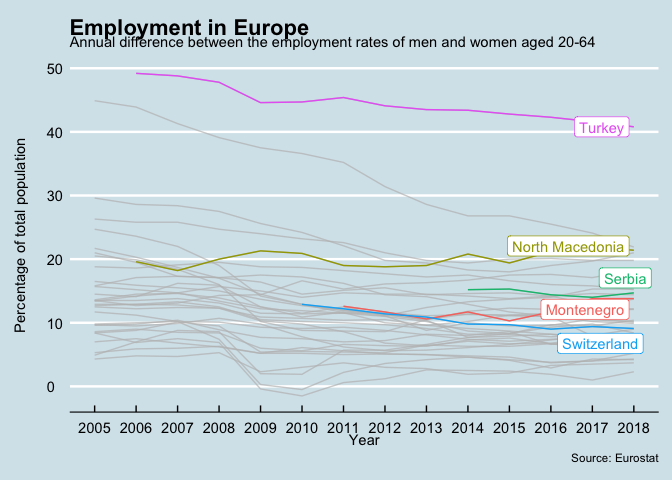
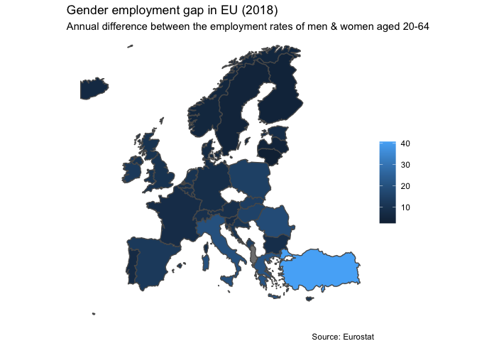
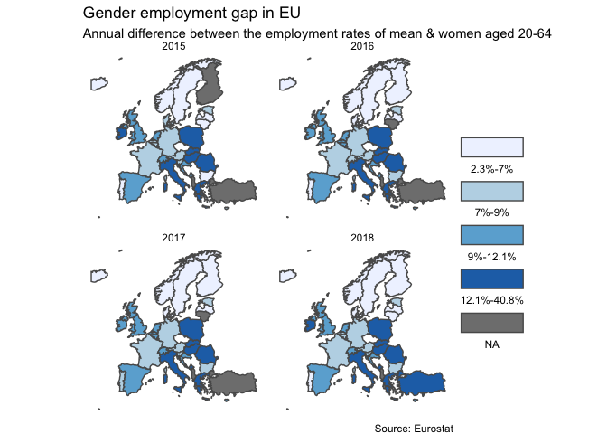

Cartography
================
Selim Ach
04/10/2020

### Employment rate per country

<!-- -->

### Gender employment gap in EU - Map visualization

<!-- -->

### Gender employment gap in EU - Differences over the years with a map visualization

<!-- -->
