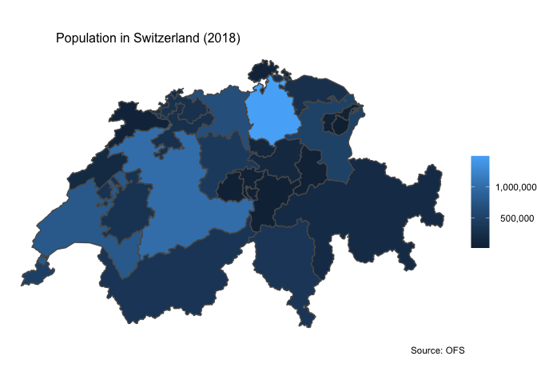
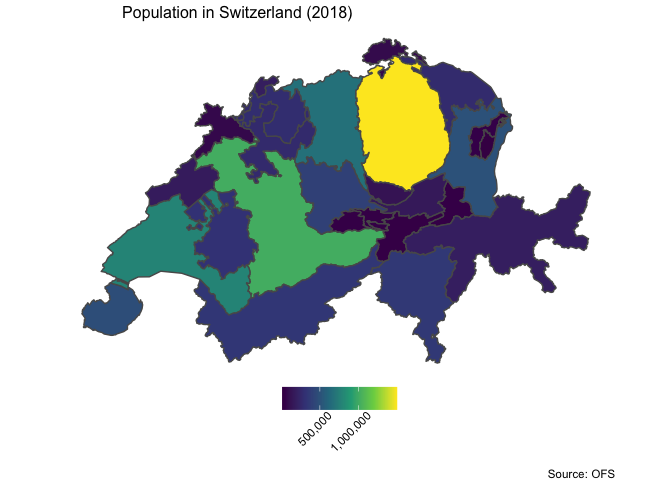
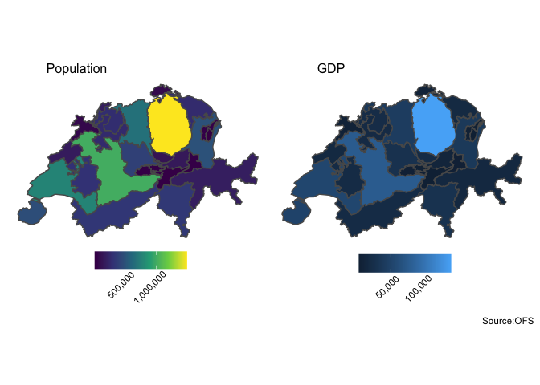

Swiss data - Population and GDP per Canton
================
Selim Ach
24/10/2020

In this report, we are presenting few cases where maps can be used
effectively to present economic data.

    ## options:        ENCODING=Latin1 
    ## Reading layer `G1K09' from data source `/Users/selim/Documents/datascience/visualization/Socio-economic/Swiss data/Data/g1g09_shp_090626/G1K09.shp' using driver `ESRI Shapefile'
    ## Simple feature collection with 26 features and 3 fields
    ## geometry type:  MULTIPOLYGON
    ## dimension:      XY
    ## bbox:           xmin: 485414 ymin: 75286 xmax: 833837 ymax: 295935
    ## CRS:            21781

### First map using several shades of blue

<!-- -->

### Another example of map using the viridis scale

<!-- -->

### COmbining information on population and GDP

<!-- -->
